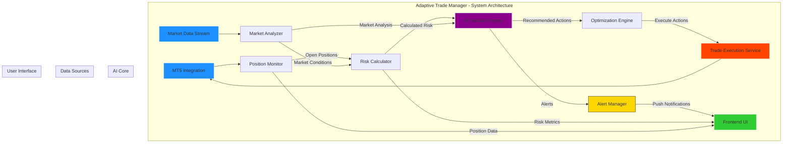

# Adaptive Trade Manager Architecture

```mermaid
graph TD
    subgraph "Adaptive Trade Manager - System Architecture"
        A[MT5 Integration] --> B[Position Monitor]
        C[Market Data Stream] --> D[Market Analyzer]

        B -- Open Positions --> E[Risk Calculator]
        D -- Market Conditions --> E

        E -- Calculated Risk --> F[AI Decision Engine]
        D -- Market Analysis --> F

        F -- Recommended Actions --> G[Optimization Engine]
        F -- Alerts --> H[Alert Manager]

        G -- Execute Actions --> I[Trade Execution Service]
        I --> A

        H -- Push Notifications --> J[Frontend UI]
        E -- Risk Metrics --> J
        B -- Position Data --> J
    end

    subgraph "AI Core"
        F
    end

    subgraph "Data Sources"
        A
        C
    end
    
    subgraph "User Interface"
        J
    end

    style F fill:#8B008B,stroke:#fff,stroke-width:2px
    style A fill:#1E90FF,stroke:#fff
    style C fill:#1E90FF,stroke:#fff
    style J fill:#32CD32,stroke:#fff
    style I fill:#FF4500,stroke:#fff
    style H fill:#FFD700,stroke:#333
``` 