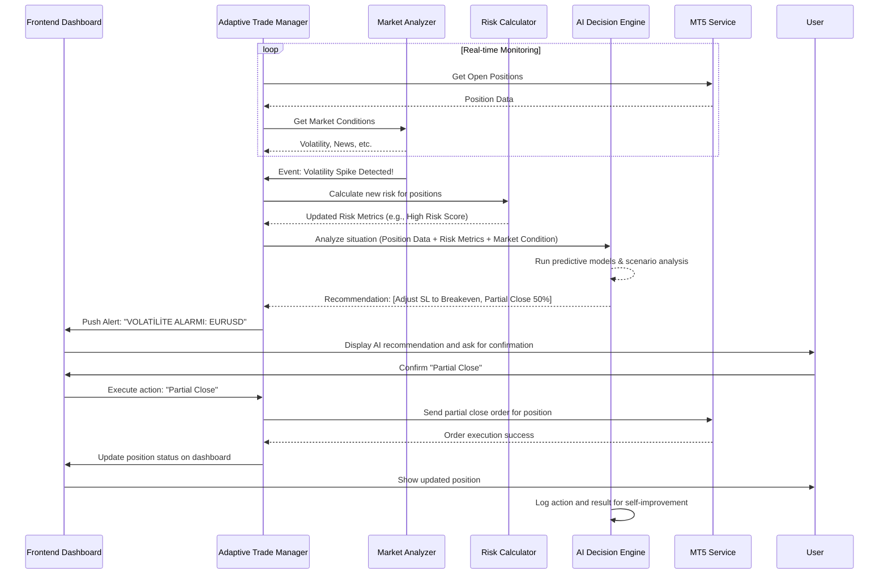

# Adaptive Trade Manager Flow

```mermaid
sequenceDiagram
    participant UI as Frontend Dashboard
    participant ATM as Adaptive Trade Manager
    participant MA as Market Analyzer
    participant RC as Risk Calculator
    participant AI as AI Decision Engine
    participant MT5 as MT5 Service

    loop Real-time Monitoring
        ATM->>MT5: Get Open Positions
        MT5-->>ATM: Position Data
        ATM->>MA: Get Market Conditions
        MA-->>ATM: Volatility, News, etc.
    end

    MA->>ATM: Event: Volatility Spike Detected!
    ATM->>RC: Calculate new risk for positions
    RC-->>ATM: Updated Risk Metrics (e.g., High Risk Score)
    
    ATM->>AI: Analyze situation (Position Data + Risk Metrics + Market Condition)
    AI-->>AI: Run predictive models & scenario analysis
    AI-->>ATM: Recommendation: [Adjust SL to Breakeven, Partial Close 50%]
    
    ATM->>UI: Push Alert: "VOLATİLİTE ALARMI: EURUSD"
    UI->>User: Display AI recommendation and ask for confirmation
    
    User->>UI: Confirm "Partial Close"
    UI->>ATM: Execute action: "Partial Close"
    
    ATM->>MT5: Send partial close order for position
    MT5-->>ATM: Order execution success
    
    ATM->>UI: Update position status on dashboard
    UI->>User: Show updated position
    
    AI->>AI: Log action and result for self-improvement
``` 