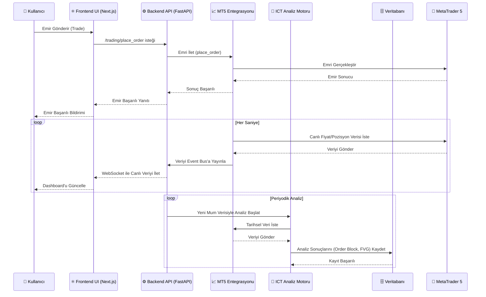

# 🔄 Veri Akış Diyagramı

Bu diyagram, kullanıcı tarafından başlatılan bir alım-satım işleminden, arka planda çalışan periyodik analizlere kadar sistemdeki ana veri akış yollarını göstermektedir.

## Mermaid Sequence Diagram

## Akış Senaryoları

### 1. Kullanıcı Alım-Satım İşlemi
1.  **Kullanıcı**, Frontend arayüzünden bir emir girer.
2.  **Frontend**, bu isteği Backend API'sine (`/api/v1/trading/place_order`) iletir.
3.  **Backend**, `MT5 Entegrasyon` servisi aracılığıyla emri MetaTrader 5'e gönderir.
4.  **MetaTrader 5**, emri işleme alır ve sonucunu döner.
5.  Sonuç, aynı yol üzerinden kullanıcıya bildirim olarak geri döner.

### 2. Canlı Veri Akışı (Real-time)
1.  `MT5 Entegrasyon` servisi, saniyede bir MetaTrader 5'ten güncel fiyatları ve açık pozisyonları çeker.
2.  Bu veriler, Backend'deki **Event Bus**'a yayınlanır.
3.  Frontend, **WebSocket** bağlantısı üzerinden bu verileri anında alır.
4.  Kullanıcının gördüğü **Dashboard** (örn. Bakiye, Kar/Zarar, Fiyat Grafikleri) gerçek zamanlı olarak güncellenir.

### 3. Otomatik Piyasa Analizi
1.  **Backend**, belirli periyotlarda (örn. her yeni H1 mumu oluştuğunda) `ICT Analiz Motoru`'nu tetikler.
2.  `ICT Analiz Motoru`, gerekli tarihsel verileri `MT5 Entegrasyonu` üzerinden çeker.
3.  Analizini (Fair Value Gap, Order Block tespiti vb.) yapar.
4.  Tespit edilen önemli yapıları ve sinyalleri ileriye dönük kullanım için **Veritabanına** kaydeder. 