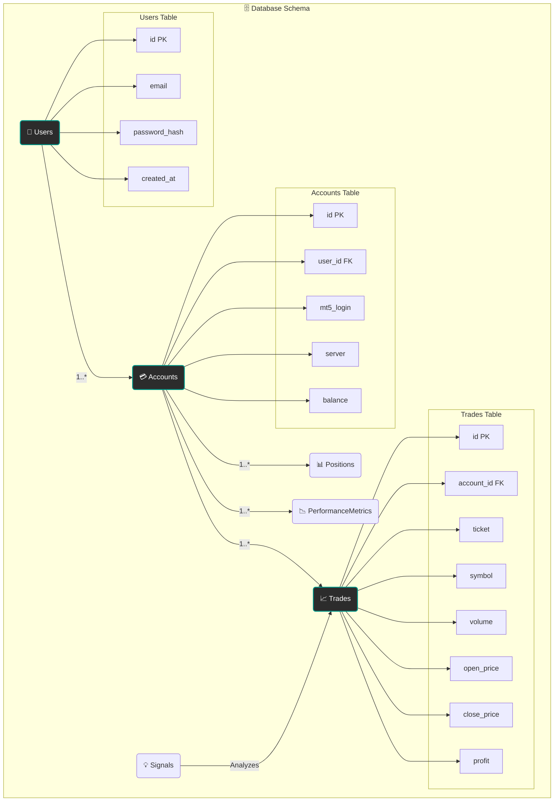

# 🗄️ Veritabanı Şeması

Bu diyagram, AI Algo Trade platformunun PostgreSQL veritabanında kullanılan ana tablaları ve aralarındaki ilişkileri göstermektedir.

## Mermaid ERD Diagram

## Tablo Açıklamaları

-   **Users:** Platforma kayıtlı kullanıcıların temel bilgilerini tutar.
-   **Accounts:** Her kullanıcının bir veya daha fazla MetaTrader 5 hesabını temsil eder. Bakiye gibi anlık bilgiler burada saklanabilir.
-   **Trades:** Gerçekleşmiş (kapanmış) alım-satım işlemlerinin kaydını tutar. Performans analizi için temel veridir.
-   **Positions:** Mevcutta açık olan pozisyonların anlık durumunu gösterir.
-   **Signals:** ICT, God Mode veya Shadow Mode tarafından üretilen alım-satım sinyallerini kaydeder.
-   **PerformanceMetrics:** Hesap bazında hesaplanan performans metriklerini (Sharpe oranı, Maks. Drawdown vb.) periyodik olarak saklar.

## İlişkiler

-   Bir **Kullanıcı** birden çok **Hesap** sahibi olabilir.
-   Bir **Hesap** üzerinden birden çok **İşlem** ve **Pozisyon** açılabilir.
-   **Sinyaller**, analiz sonucu olarak **İşlemlerin** açılmasına neden olabilir.

Bu yapı, kullanıcı ve hesap bazında detaylı performans takibi ve raporlama yapılmasına olanak tanır. 