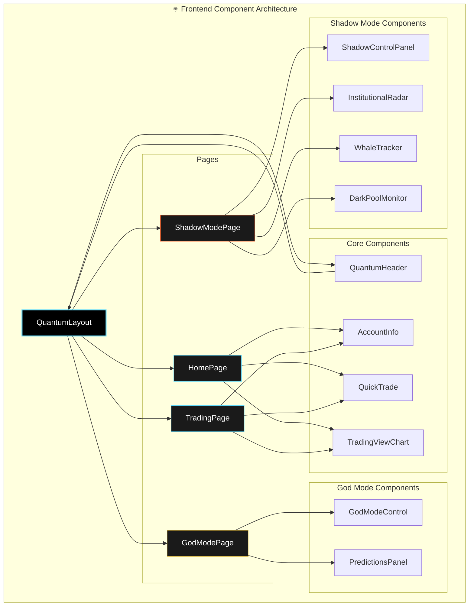

# ⚛️ Frontend Component Architecture

Bu diyagram, Next.js ile geliştirilen frontend uygulamasının ana bileşenlerini ve sayfalar arası ilişkilerini göstermektedir.

## Mermaid Diagram

## Bileşen Açıklamaları

-   **QuantumLayout:** Tüm sayfaları saran ana layout bileşeni. `QuantumHeader`'ı içerir.
-   **Pages:** Uygulamanın ana sayfaları (`HomePage`, `TradingPage`, `GodModePage`, `ShadowModePage`).
-   **Core Components:** Uygulama genelinde kullanılan temel bileşenler (`AccountInfo`, `QuickTrade`, `TradingViewChart`).
-   **God Mode / Shadow Mode Components:** İlgili modüllere özel, modüler olarak geliştirilmiş bileşen grupları.

Bu yapı, sayfalar ve bileşenler arasında net bir hiyerarşi ve yeniden kullanılabilirlik sağlar. 