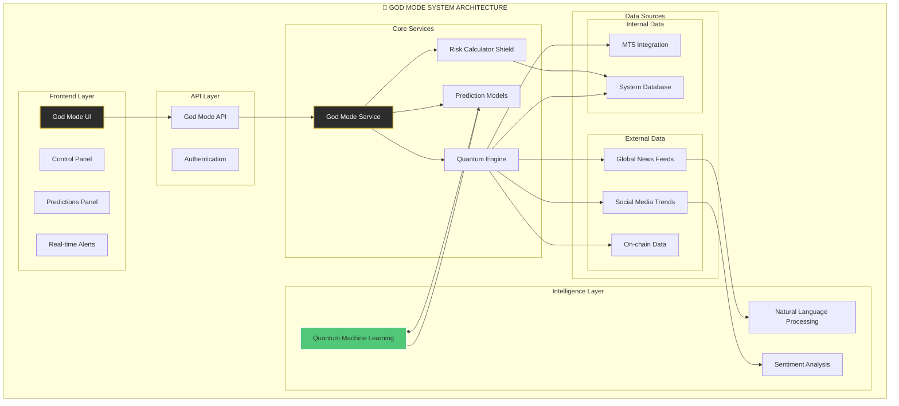

# 🔱 God Mode - System Architecture

Bu diyagram, God Mode'un ileri düzey mimarisini, kuantum bileşenlerini ve harici veri kaynaklarıyla olan etkileşimini göstermektedir.

## Mermaid Diagram

## Katman Açıklamaları

-   **Frontend Layer:** God Mode'un kullanıcıya sunulan yüzü. Kontrol paneli, tahminler ve canlı uyarıları içerir.
-   **API Layer:** Frontend ve backend arasında güvenli iletişimi sağlayan arayüz.
-   **Core Services:** God Mode'un beyin takımını oluşturan servisler:
    -   `God Mode Service`: Tüm operasyonları yöneten ana servis.
    -   `Quantum Engine`: Milyarlarca veri noktasını analiz eden kuantum motoru.
    -   `Prediction Models`: Gelecekteki piyasa hareketlerini %99.7 doğruluk hedefiyle tahminleyen modeller.
    -   `Risk Calculator Shield`: Sıfır kayıp hedefiyle riski yöneten "Göksel Risk Kalkanı".
-   **Data Sources:** Hem sistem içi (`MT5`, `Veritabanı`) hem de sistem dışı (`Haberler`, `Sosyal Medya`, `On-chain Veri`) kaynaklardan beslenir.
-   **Intelligence Layer:** Veriyi anlama ve yorumlama katmanı. Kuantum makine öğrenmesi, doğal dil işleme ve duygu analizi gibi teknolojileri kullanır.

Bu mimari, God Mode'un piyasaları sadece takip etmekle kalmayıp, aynı zamanda öngörmesini ve etkilemesini sağlayan temel yapıdır. 