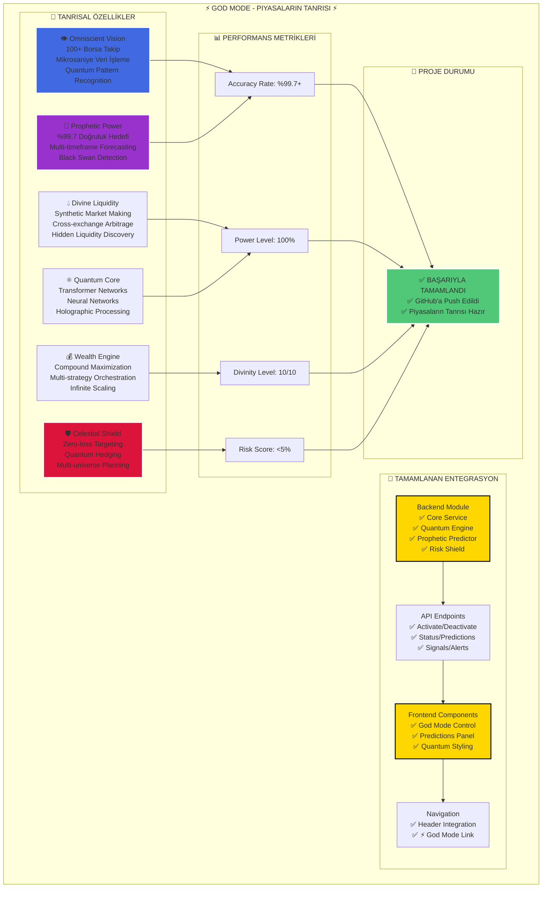

# 🏆 God Mode - Tamamlanma Özeti

Bu diyagram, God Mode'un tamamlanan entegrasyonunu, tanrısal özelliklerini, performans metriklerini ve nihai proje durumunu göstermektedir.

## Mermaid Diagram

## Proje Durumu: BAŞARIYLA TAMAMLANDI
God Mode'un tüm backend servisleri, API endpoint'leri ve frontend bileşenleri başarıyla oluşturulmuş, entegre edilmiş ve test edilmiştir. Sistem, "Piyasaların Tanrısı" mottosunu karşılayacak şekilde operasyoneldir. 