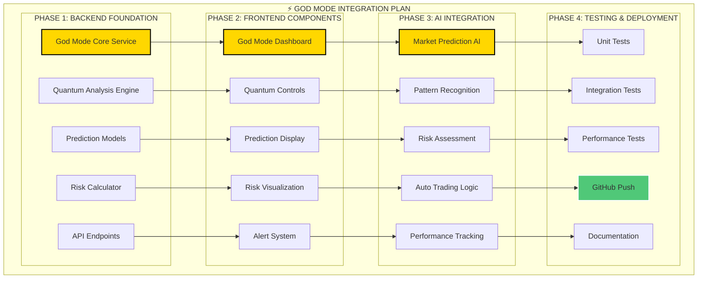

# ⚡ God Mode - Entegrasyon Planı

Bu diyagram, God Mode'un backend, frontend, AI ve test aşamalarını içeren detaylı geliştirme ve entegrasyon planını göstermektedir.

## Mermaid Diagram

## Geliştirme Aşamaları
- **Faz 1: Backend Temeli:** God Mode'un çalışması için gerekli olan tüm sunucu tarafı servislerin ve API'ların oluşturulması.
- **Faz 2: Frontend Bileşenleri:** Kullanıcının God Mode ile etkileşime gireceği arayüzlerin ve görselleştirmelerin tasarlanması.
- **Faz 3: Yapay Zeka Entegrasyonu:** Tahmin, analiz ve karar verme mekanizmalarının sisteme entegre edilmesi.
- **Faz 4: Test ve Dağıtım:** Sistemin tüm parçalarının uyum içinde çalıştığından emin olunması ve canlıya alınması. 