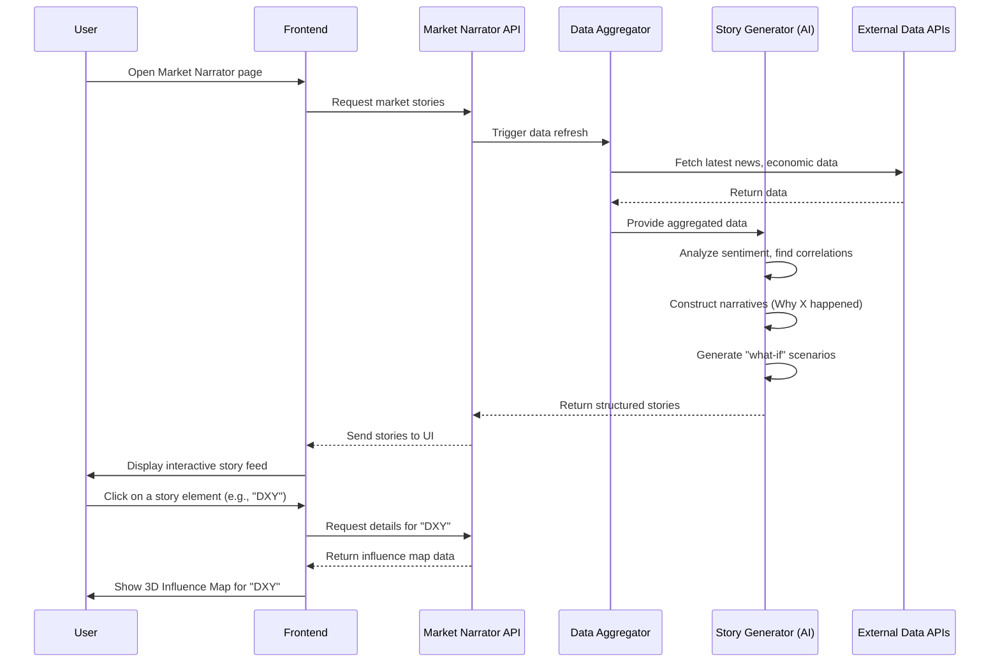

# Market Narrator Flow

```mermaid
sequenceDiagram
    participant User
    participant Frontend
    participant NarratorAPI as Market Narrator API
    participant Aggregator as Data Aggregator
    participant StoryEngine as Story Generator (AI)
    participant ExtAPIs as External Data APIs
    
    User->>Frontend: Open Market Narrator page
    Frontend->>NarratorAPI: Request market stories
    
    NarratorAPI->>Aggregator: Trigger data refresh
    Aggregator->>ExtAPIs: Fetch latest news, economic data
    ExtAPIs-->>Aggregator: Return data
    Aggregator->>StoryEngine: Provide aggregated data
    
    StoryEngine->>StoryEngine: Analyze sentiment, find correlations
    StoryEngine->>StoryEngine: Construct narratives (Why X happened)
    StoryEngine->>StoryEngine: Generate "what-if" scenarios
    
    StoryEngine-->>NarratorAPI: Return structured stories
    NarratorAPI-->>Frontend: Send stories to UI
    
    Frontend->>User: Display interactive story feed
    
    User->>Frontend: Click on a story element (e.g., "DXY")
    Frontend->>NarratorAPI: Request details for "DXY"
    NarratorAPI-->>Frontend: Return influence map data
    Frontend->>User: Show 3D Influence Map for "DXY"
``` 