# ✨ Devrimsel Özellikler - Genel Bakış

Bu diyagram, AI Algo Trade platformunun dört ana devrimsel özelliğinin ve God Mode'un temel iş akışlarını özetlemektedir.

## Mermaid Diagram

```mermaid
graph TB
    subgraph "🧠 THE STRATEGY WHISPERER"
        SW1[Natural Language Input] --> SW2[AI Language Model]
        SW2 --> SW3[Strategy Parser]
        SW3 --> SW4[MQL5 Code Generator]
        SW4 --> SW5[Backtest Engine]
        SW5 --> SW6[Performance Analyzer]
        SW6 --> SW7[One-Click Deploy]
        
        SW2 -.-> SWF1[Intent Recognition]
        SW2 -.-> SWF2[Parameter Extraction]
        SW3 -.-> SWF3[Strategy Validation]
        SW4 -.-> SWF4[Code Optimization]
        SW5 -.-> SWF5[Monte Carlo Simulation]
        SW6 -.-> SWF6[Risk Assessment]
    end
    
    subgraph "📖 THE MARKET NARRATOR"
        MN1[Multi-Source Data] --> MN2[AI Story Engine]
        MN2 --> MN3[Correlation Analyzer]
        MN3 --> MN4[Narrative Generator]
        MN4 --> MN5[Visual Story Maps]
        MN5 --> MN6[Personalized Reports]
        
        MN1 -.-> MNF1[News/Economic Data]
        MN1 -.-> MNF2[Technical Patterns]
        MN1 -.-> MNF3[Sentiment Analysis]
        MN3 -.-> MNF4[Hidden Connections]
        MN4 -.-> MNF5[Multi-Language Support]
    end
    
    subgraph "🥷 SHADOW MODE"
        SM1[Institutional Tracker] --> SM2[Pattern Detector]
        SM2 --> SM3[Volume Analyzer]
        SM3 --> SM4[Liquidity Hunter]
        SM4 --> SM5[Stealth Executor]
        SM5 --> SM6[Trail Manager]
        
        SM2 -.-> SMF1[Dark Pool Detection]
        SM3 -.-> SMF2[Smart Money Flow]
        SM4 -.-> SMF3[Hidden Order Books]
        SM5 -.-> SMF4[Iceberg Orders]
    end
    
    subgraph "🛡️ ADAPTIVE TRADE MANAGER"
        AT1[Position Monitor] --> AT2[Risk Calculator]
        AT2 --> AT3[Market Scanner]
        AT3 --> AT4[AI Decision Engine]
        AT4 --> AT5[Dynamic Adjuster]
        AT5 --> AT6[Alert System]
        
        AT3 -.-> ATF1[News Impact Analysis]
        AT3 -.-> ATF2[Volatility Prediction]
        AT4 -.-> ATF3[Scenario Planning]
        AT5 -.-> ATF4[Auto SL/TP Adjust]
    end
    
    subgraph "⚡ GOD MODE"
        GM1[Quantum Predictor] --> GM2[Market Manipulator]
        GM2 --> GM3[Liquidity Creator]
        GM3 --> GM4[Price Action Controller]
        GM4 --> GM5[Profit Maximizer]
        
        GM1 -.-> GMF1[Future Price Paths]
        GM2 -.-> GMF2[Order Flow Control]
        GM3 -.-> GMF3[Synthetic Markets]
        GM4 -.-> GMF4[Whale Behavior]
    end
    
    style SW1 fill:#4A90E2,stroke:#fff,stroke-width:2px
    style MN1 fill:#50C878,stroke:#fff,stroke-width:2px
    style SM1 fill:#8B4513,stroke:#fff,stroke-width:2px
    style AT1 fill:#FF6B6B,stroke:#fff,stroke-width:2px
    style GM1 fill:#FFD700,stroke:#000,stroke-width:3px
```

## Modül Açıklamaları
- **Strategy Whisperer:** Doğal dil ile söylenen stratejileri MQL5 koduna dönüştürür.
- **Market Narrator:** Piyasa verilerini analiz ederek anlamlı ve görsel hikayeler oluşturur.
- **Shadow Mode:** Kurumsal oyuncuların hareketlerini takip ederek gizli operasyonlar yürütür.
- **Adaptive Trade Manager:** Riskleri dinamik olarak yönetir ve pozisyonları piyasa koşullarına göre ayarlar.
- **God Mode:** Piyasaları tahmin etmenin ötesinde, onları yönlendirmeyi hedefler. 