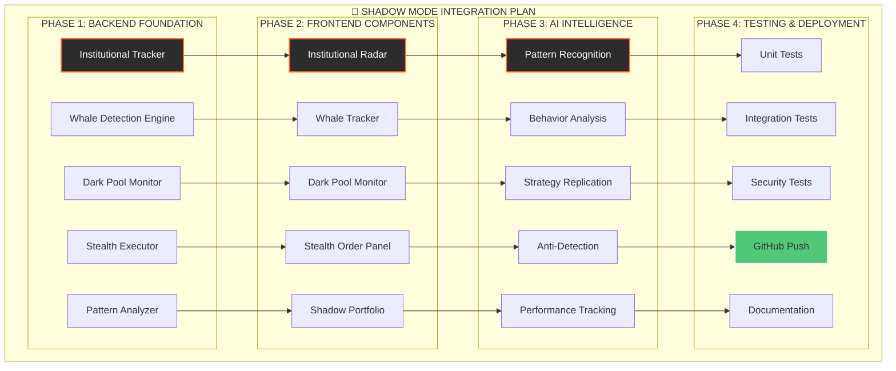

# 🥷 Shadow Mode - Entegrasyon Planı

Bu diyagram, Shadow Mode'un backend, frontend, AI ve test aşamalarını içeren detaylı geliştirme ve entegrasyon planını göstermektedir.

## Mermaid Diagram

## Geliştirme Aşamaları
- **Faz 1: Backend Temeli:** Kurumsal takip, whale tespiti ve gizli emir altyapısının kurulması.
- **Faz 2: Frontend Bileşenleri:** Kullanıcının Shadow Mode verilerini izleyeceği ve kontrol edeceği arayüzlerin geliştirilmesi.
- **Faz 3: Yapay Zeka Entegrasyonu:** Davranış analizi, pattern tanıma ve strateji kopyalama gibi akıllı özelliklerin eklenmesi.
- **Faz 4: Test ve Dağıtım:** Sistemin güvenli ve stabil çalıştığından emin olunarak canlıya alınması. 