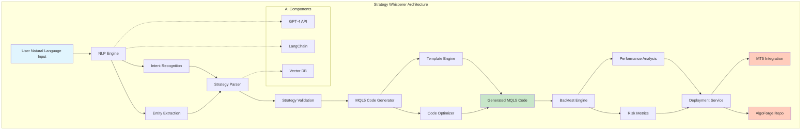

# Strategy Whisperer Architecture

```mermaid
graph TB
    subgraph "Strategy Whisperer Architecture"
        A[User Natural Language Input] --> B[NLP Engine]
        B --> C[Intent Recognition]
        B --> D[Entity Extraction]
        
        C --> E[Strategy Parser]
        D --> E
        
        E --> F[Strategy Validation]
        F --> G[MQL5 Code Generator]
        
        G --> H[Template Engine]
        G --> I[Code Optimizer]
        
        H --> J[Generated MQL5 Code]
        I --> J
        
        J --> K[Backtest Engine]
        K --> L[Performance Analysis]
        K --> M[Risk Metrics]
        
        L --> N[Deployment Service]
        M --> N
        
        N --> O[MT5 Integration]
        N --> P[AlgoForge Repo]
        
        subgraph "AI Components"
            Q[GPT-4 API]
            R[LangChain]
            S[Vector DB]
        end
        
        B -.-> Q
        B -.-> R
        E -.-> S
    end
    
    style A fill:#e1f5fe
    style J fill:#c8e6c9
    style O fill:#ffccbc
    style P fill:#ffccbc
``` 