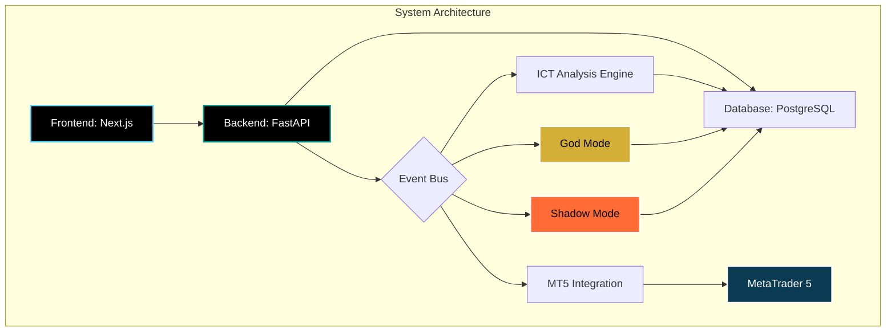

# 🏗️ Genel Sistem Mimarisi

Bu diyagram, AI Algo Trade platformunun tüm ana bileşenlerini ve aralarındaki ilişkileri göstermektedir.

## Mermaid Diagram

## Bileşenler

-   **Frontend (Next.js):** Kullanıcı arayüzü, quantum dashboard'lar ve interaktif bileşenler.
-   **Backend (FastAPI):** Ana iş mantığı, API endpoint'leri ve servis yönetimi.
-   **Event Bus:** Bileşenler arası asenkron iletişimi sağlayan olay tabanlı sistem.
-   **Database (PostgreSQL):** Alım-satım geçmişi, performans metrikleri ve kullanıcı verilerinin saklandığı veritabanı.
-   **MT5 Integration:** MetaTrader 5 ile gerçek zamanlı veri alışverişi ve emir yönetimi.
-   **ICT Analysis Engine:** Inner Circle Trader konseptlerine dayalı piyasa analizi motoru.
-   **God Mode:** Piyasaya yön veren, tahmine dayalı alım-satım motoru.
-   **Shadow Mode:** Kurumsal oyuncuları takip eden gizli mod.
-   **MetaTrader 5:** Canlı piyasa verilerinin ve alım-satım altyapısının sağlandığı platform.

Bu yapı, sistemin modüler, ölçeklenebilir ve yüksek performanslı olmasını sağlar. 