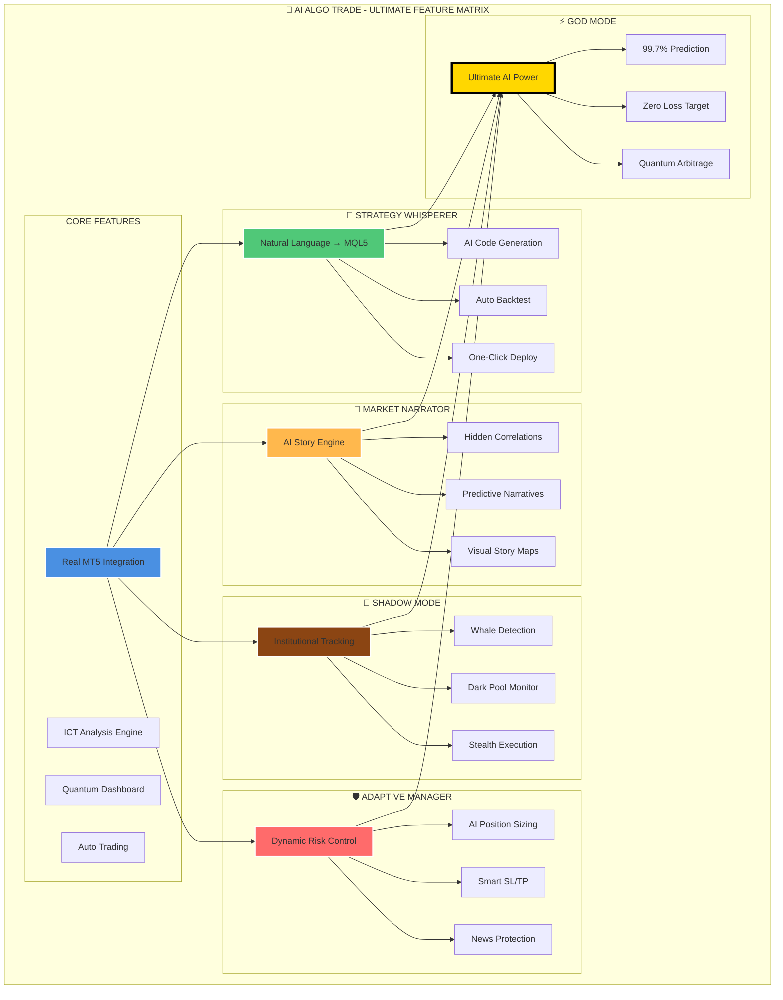

# MATRIX: Proje Özellik Matrisi

Bu diyagram, AI Algo Trade platformunun temel, gelişmiş ve nihai özelliklerini (God Mode) bir matris üzerinde göstererek aralarındaki ilişkiyi ve hiyerarşiyi ortaya koymaktadır.

## Mermaid Diagram

## Hiyerarşi
1.  **Core Features:** Sistemin temelini oluşturan, vazgeçilmez özellikler.
2.  **Devrimsel Özellikler:** (Whisperer, Narrator, Shadow, Adaptive) Core özelliklerin üzerine inşa edilen, piyasada rekabet avantajı sağlayan modüller.
3.  **God Mode:** Diğer tüm modüllerin yeteneklerini birleştiren ve kuantum teknolojilerle bir üst seviyeye taşıyan nihai katman. 