# MATRIX: Proje Özellik Matrisi

Bu diyagram, AI Algo Trade platformunun temel, gelişmiş ve nihai özelliklerini (God Mode) bir matris üzerinde göstererek aralarındaki ilişkiyi ve hiyerarşiyi ortaya koymaktadır.

## Mermaid Diagram

```mermaid
graph TB
    subgraph "🌟 AI ALGO TRADE - ULTIMATE FEATURE MATRIX"
        
        subgraph "CORE FEATURES"
            CF1[Real MT5 Integration]
            CF2[ICT Analysis Engine]
            CF3[Quantum Dashboard]
            CF4[Auto Trading]
        end
        
        subgraph "🧠 STRATEGY WHISPERER"
            SW[Natural Language → MQL5]
            SW --> SWF1[AI Code Generation]
            SW --> SWF2[Auto Backtest]
            SW --> SWF3[One-Click Deploy]
        end
        
        subgraph "📖 MARKET NARRATOR"
            MN[AI Story Engine]
            MN --> MNF1[Hidden Correlations]
            MN --> MNF2[Predictive Narratives]
            MN --> MNF3[Visual Story Maps]
        end
        
        subgraph "🥷 SHADOW MODE"
            SM[Institutional Tracking]
            SM --> SMF1[Whale Detection]
            SM --> SMF2[Dark Pool Monitor]
            SM --> SMF3[Stealth Execution]
        end
        
        subgraph "🛡️ ADAPTIVE MANAGER"
            AM[Dynamic Risk Control]
            AM --> AMF1[AI Position Sizing]
            AM --> AMF2[Smart SL/TP]
            AM --> AMF3[News Protection]
        end
        
        subgraph "⚡ GOD MODE"
            GM[Ultimate AI Power]
            GM --> GMF1[99.7% Prediction]
            GM --> GMF2[Zero Loss Target]
            GM --> GMF3[Quantum Arbitrage]
        end
        
        CF1 --> SW
        CF1 --> MN
        CF1 --> SM
        CF1 --> AM
        
        SW --> GM
        MN --> GM
        SM --> GM
        AM --> GM
    end
    
    style CF1 fill:#4A90E2,stroke:#fff,stroke-width:2px
    style SW fill:#50C878,stroke:#fff,stroke-width:2px
    style MN fill:#FFB84D,stroke:#fff,stroke-width:2px
    style SM fill:#8B4513,stroke:#fff,stroke-width:2px
    style AM fill:#FF6B6B,stroke:#fff,stroke-width:2px
    style GM fill:#FFD700,stroke:#000,stroke-width:4px
```

## Hiyerarşi
1.  **Core Features:** Sistemin temelini oluşturan, vazgeçilmez özellikler.
2.  **Devrimsel Özellikler:** (Whisperer, Narrator, Shadow, Adaptive) Core özelliklerin üzerine inşa edilen, piyasada rekabet avantajı sağlayan modüller.
3.  **God Mode:** Diğer tüm modüllerin yeteneklerini birleştiren ve kuantum teknolojilerle bir üst seviyeye taşıyan nihai katman. 