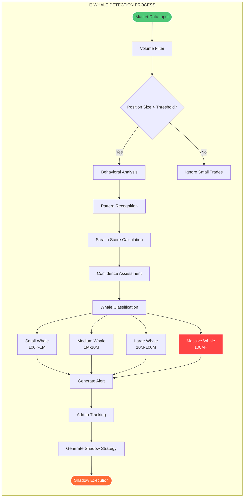

# 🐋 Whale Detection Process

Büyük oyuncu (whale) tespit sürecinin detaylı akış diyagramı.

## Process Flow

## Süreç Adımları

### 1. Market Data Input
- Gerçek zamanlı piyasa verisi alımı
- Volume ve price action analizi
- Order book derinlik verisi

### 2. Volume Filter
- Minimum volume threshold kontrolü
- Anormal volume spike tespiti
- Statistical deviation analizi

### 3. Position Size Analysis
- Pozisyon büyüklüğü hesaplama
- Threshold karşılaştırması
- Risk assessment

### 4. Behavioral Analysis
- Trading pattern analizi
- Execution style profiling
- Historical behavior matching

### 5. Whale Classification
- **Small Whale**: 100K - 1M
- **Medium Whale**: 1M - 10M  
- **Large Whale**: 10M - 100M
- **Massive Whale**: 100M+

### 6. Shadow Strategy Generation
- Pattern-based strategy creation
- Risk-adjusted position sizing
- Timing optimization 