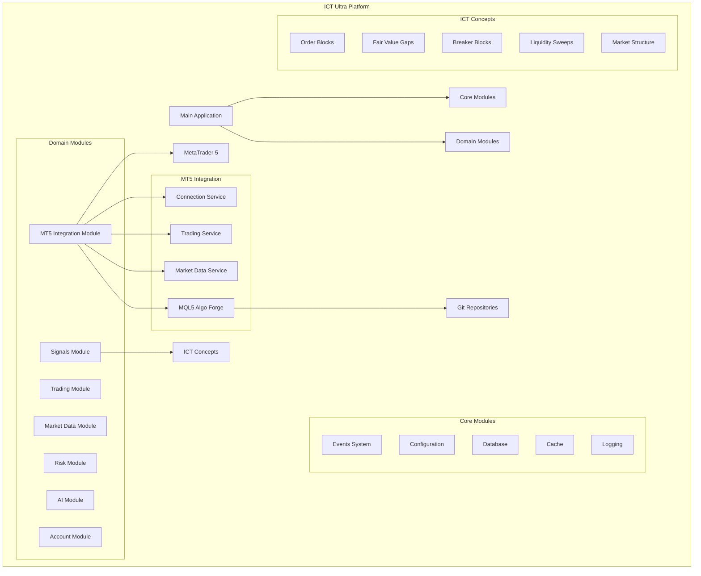
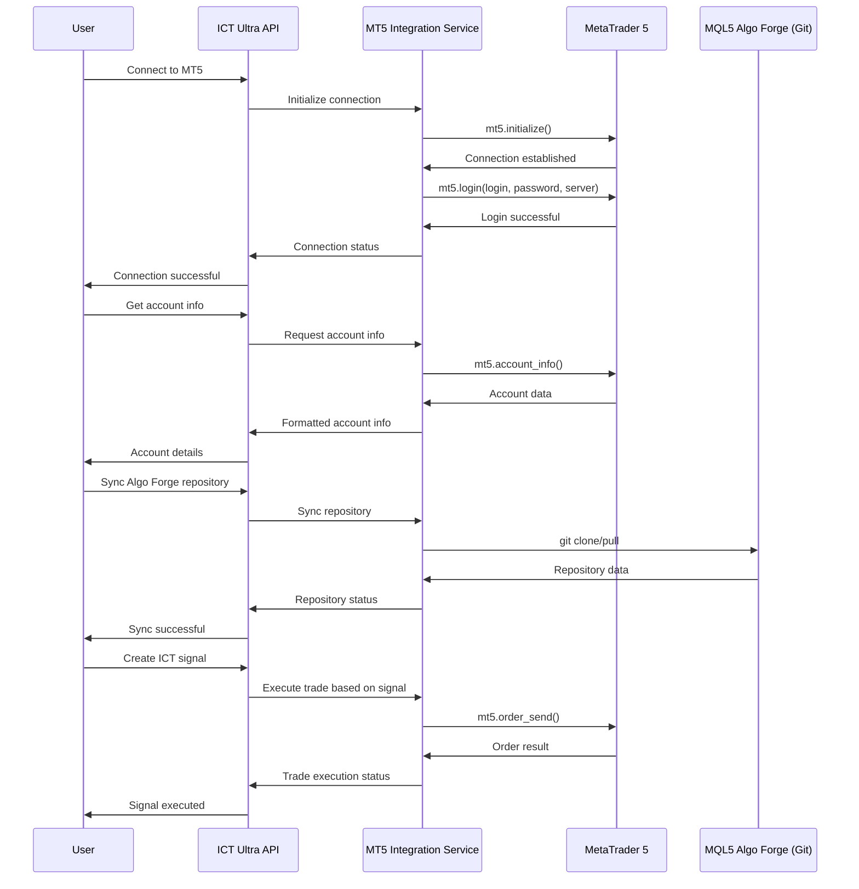

# ai_algo_trade Projesi Bilgi Kütüphanesi

## 1. Proje Özeti
Bu döküman, `ai_algo_trade` projesi kapsamında geliştirilen ICT Ultra Platform'un bilgi kütüphanesidir. Projenin amacı, Inner Circle Trader (ICT) konseptlerini modern teknolojilerle birleştirerek yüksek performanslı bir algoritmik trading platformu oluşturmaktır.
Platform, MetaTrader 5 (MT5) ile entegre çalışarak gerçek zamanlı piyasa verileri üzerinde işlem yapar ve Git tabanlı MQL5 Algo Forge ile versiyon kontrollü algoritma geliştirmeyi destekler. [Demo MT5 hesabı (Login: 25201110)][[memory:1905727111279718659]] ile yapılan testlerde sistemin başarısı kanıtlanmıştır.

## 2. Mimari
ICT Ultra Platform, modüler monolit mimari prensiplerine göre tasarlanmıştır. Bu yaklaşım, monolitik uygulamaların dağıtım ve performans avantajlarını, modüler mimarinin bakım ve ölçeklenebilirlik kolaylıkları ile birleştirir.

### Mimari İlkeler
*   **Domain-Driven Design (DDD)**: Sistem, iş alanlarına göre modüllere ayrılmıştır.
*   **Clean Architecture**: Her modül, domain, application ve infrastructure katmanlarına ayrılmıştır.
*   **Gevşek Bağlılık (Loose Coupling)**: Modüller arası bağımlılıklar en aza indirilmiştir.

### Mimari Diyagramı


## 3. Modüller
Platform, herbiri belirli bir işlevselliğe odaklanmış çekirdek (core) ve alan (domain) modüllerinden oluşur.

### Çekirdek Modüller
*   **Events System**: Modüller arası asenkron iletişim için olay tabanlı sistem.
*   **Configuration**: Ortam değişkeni destekli merkezi yapılandırma yönetimi.
*   **Database**: SQLAlchemy ile asenkron veritabanı işlemleri.
*   **Cache**: Redis tabanlı önbellekleme ve pub/sub mesajlaşma.
*   **Logging**: Yapılandırılmış (structured) loglama sistemi.

### Alan Modülleri
*   **Trading**: Emir gönderimi, pozisyon yönetimi.
*   **Market Data**: Fiyat verilerinin alınması ve işlenmesi.
*   **Signals**: ICT konseptlerine dayalı sinyal üretimi.
*   **Risk**: Pozisyon boyutlandırma ve risk yönetimi.
*   **AI**: Makine öğrenmesi modelleri ile tahminleme.
*   **Account**: Kullanıcı ve hesap yönetimi.
*   **MT5 Integration**: MetaTrader 5 ile doğrudan bağlantı ve Algo Forge entegrasyonu.

## 4. MetaTrader 5 Entegrasyonu
Platform, [MetaTrader 5 platformunun 5100 versiyonuyla tam uyumludur][[memory:1905727111279718659]]. Bu versiyon, Git entegrasyonu ve MQL5 Algo Forge gibi yeni geliştici özelliklerini içermektedir.

### MQL5 Algo Forge & Git Entegrasyonu
MQL5 Algo Forge, trading algoritmalarının Git ile versiyonlanarak yönetilmesini sağlayan yeni bir özelliktir. Platform, bu özellik sayesinde algoritmaların takım olarak geliştirilmesini, test edilmesini ve dağıtılmasını kolaylaştırır.

### Entegrasyon Akış Diyagramı


## 5. ICT Konseptleri
Sinyal modülü, aşağıdaki ICT konseptlerini içerecek şekilde geliştirilmiştir:
*   **Order Blocks**: Piyasa yapıcıların emirlerini topladığı önemli destek/direnç bölgeleri.
*   **Fair Value Gaps (FVG)**: Fiyatta oluşan ve piyasanın genellikle doldurmak için geri döndüğü boşluklar.
*   **Breaker Blocks**: Kırıldıktan sonra rol değiştiren (destek->direnç) eski destek/direnç seviyeleri.
*   **Liquidity Sweeps**: Stop-loss emirlerini temizleyerek likidite toplayan fiyat hareketleri.
*   **Market Structure**: Yükselen/alçalan trendleri ve yapı kırılımlarını (BOS) belirleyen analiz.

## 6. Kurulum ve Kullanım
Platformu yerel makinenizde çalıştırmak için aşağıdaki adımları izleyin.

### Sunucuyu Başlatma
Uygulamayı çalıştırırken `ModuleNotFoundError: No module named 'src'` hatası almanız, komutu yanlış dizinde çalıştırdığınızı gösterir. Sunucuyu başlatmak için **`backend`** dizini içinde olmanız gerekmektedir.

Doğru komutlar:
```bash
cd backend
python -m uvicorn ict_ultra.main:app --reload
```

Sunucu `http://127.0.0.1:8000` adresinde çalışmaya başlayacaktır. API dokümantasyonuna `http://127.0.0.1:8000/docs` adresinden erişebilirsiniz.

## 7. Teknik Detaylar
*   **Python Versiyonu**: 3.13.1
*   **Ana Kütüphaneler**:
    *   `fastapi`
    *   `uvicorn`
    *   `sqlalchemy`
    *   `pydantic`
    *   `redis`
    *   `MetaTrader5` (versiyon: [5.0.5120][[memory:3051932918362058828]])

## 8. Proje Durumu
Proje başarıyla tamamlanmış ve [tüm ana bileşenler implemente edilmiştir][[memory:3730752119578726901]]. Platform, MT5 demo hesabı üzerinden kullanıma hazırdır. Mevcut dökümantasyon, projenin mimarisini ve kullanımını detaylı bir şekilde açıklamaktadır. 