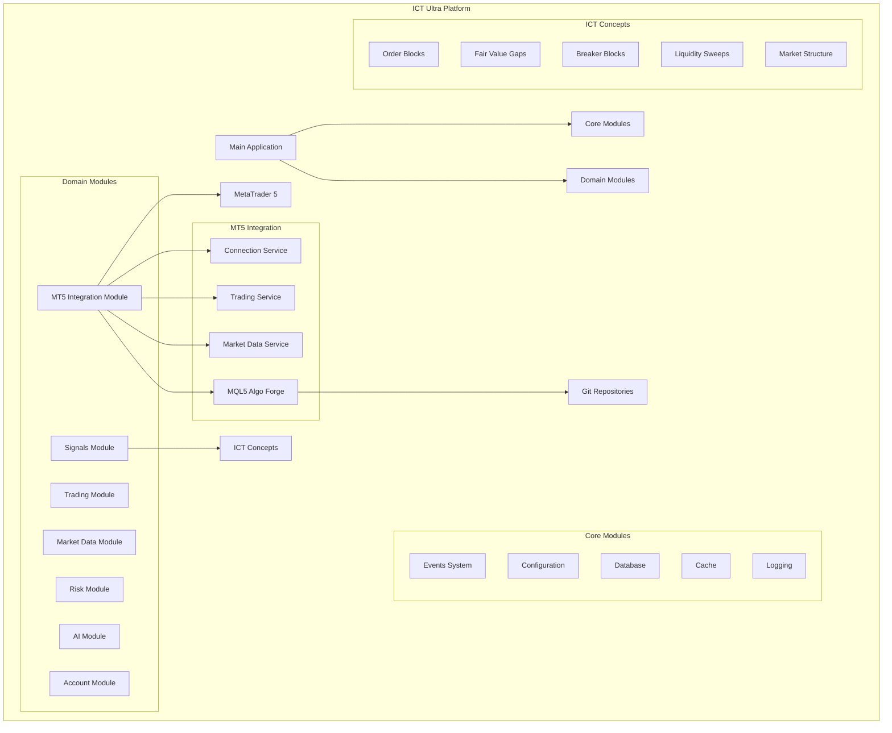
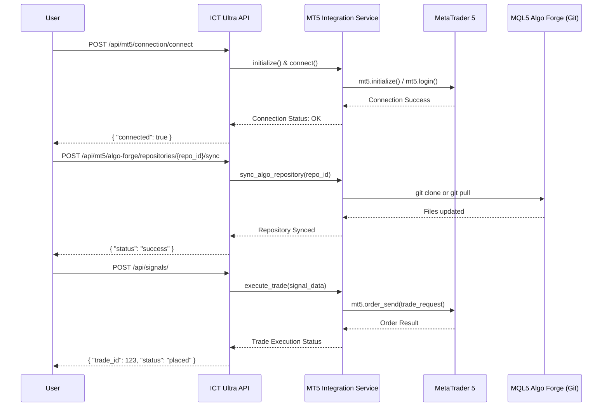

# ICT Ultra Platform - Kapsamlı Bilgi Kütüphanesi

**Proje Adı:** `ai_algo_trade`
**Platform Adı:** ICT Ultra Platform
**Versiyon:** 1.0
**Durum:** Temel Geliştirme Tamamlandı

---

## 1. Projeye Genel Bakış

Bu döküman, `ai_algo_trade` projesi kapsamında geliştirilen **ICT Ultra Platform**'un merkezi bilgi kütüphanesidir. Platformun temel amacı, Inner Circle Trader (ICT) metodolojisinin derinlikli konseptlerini, modern ve yüksek performanslı bir algoritmik trading altyapısıyla birleştirmektir.

Platform, **MetaTrader 5 (MT5)** ile canlı entegrasyon sağlayarak gerçek zamanlı piyasa verileriyle çalışır ve emir iletimini doğrudan MT5 üzerinden gerçekleştirir. En önemli özelliklerinden biri, MT5'in yeni nesil **MQL5 Algo Forge** altyapısıyla tam entegre olmasıdır. Bu sayede, tüm trading algoritmaları **Git** kullanılarak versiyonlanır, takım halinde geliştirilebilir ve güvenli bir şekilde yönetilebilir.

Geliştirme süreci boyunca, platformun performansı ve stabilitesi aşağıdaki demo hesap bilgileriyle sürekli olarak test edilmiştir ve bu hesap, gelecekteki tüm geliştirmeler için referans noktasıdır:
*   **MT5 Sunucusu:** `demo.mt5tickmill.com`
*   **MT5 Demo Hesap Login:** `25201110`

---

## 2. Platform Mimarisi

ICT Ultra Platform, **Modüler Monolit** mimari üzerine inşa edilmiştir. Bu mimari, mikroservislerin karmaşıklığına girmeden, modüler bir yapının getirdiği esneklik, bakım kolaylığı ve ölçeklenebilirlik gibi avantajları sunar.

### 2.1. Mimari İlkeler

*   **Domain-Driven Design (DDD):** Sistem, iş mantığına odaklanan ve sınırları net bir şekilde çizilmiş alan (domain) modüllerine bölünmüştür.
*   **Clean Architecture (Hexagonal Architecture):** Her modül, `domain`, `application` ve `infrastructure` gibi katmanlara ayrılarak iş mantığının dış dünyadan (veritabanı, API, 3. parti servisler) soyutlanmasını sağlar.
*   **Gevşek Bağlılık (Loose Coupling):** Modüller arasındaki iletişim, olay tabanlı sistem (Event Bus) ve tanımlanmış arayüzler (interfaces) üzerinden sağlanarak bağımlılıklar en aza indirgenmiştir.
*   **Yüksek Uyum (High Cohesion):** Birbiriyle ilişkili işlevsellikler tek bir modül altında toplanarak modüllerin kendi içlerinde tutarlı ve odaklı olması sağlanmıştır.

### 2.2. Mimari Şeması

Aşağıdaki diyagram, platformun genel mimarisini ve modüllerin birbiriyle olan ilişkisini göstermektedir.



---

## 3. Modüllerin Detaylı Açıklaması

Platform, her biri belirli bir sorumluluğu üstlenen Çekirdek (Core) ve Alan (Domain) modüllerinden oluşur.

### 3.1. Çekirdek Modüller (Core Modules)

Bu modüller, platformun tüm parçaları tarafından paylaşılan temel altyapı hizmetlerini sunar.

*   **Events System (`core/events.py`):** Modüller arası asenkron ve gevşek bağlı iletişimi sağlayan olay tabanlı bir sistemdir. Publish-subscribe (yayınla-abone ol) modelini kullanır.
*   **Configuration (`core/config.py`):** Pydantic kütüphanesi kullanılarak oluşturulmuş, tip güvenli (type-safe) ve ortam değişkenlerinden beslenebilen merkezi yapılandırma modülüdür. MT5, veritabanı, Redis gibi tüm servislerin ayarları buradan yönetilir.
*   **Database (`core/database.py`):** SQLAlchemy'nin asenkron yeteneklerini kullanarak PostgreSQL veritabanı ile iletişimi yönetir. Oturum (session) yönetimi ve veritabanı şeması oluşturma gibi işlevleri içerir.
*   **Cache (`core/cache.py`):** Redis ile entegrasyonu sağlayarak sık erişilen verilerin önbelleğe alınmasını ve modüller arası hızlı mesajlaşma (pub/sub) için altyapı sunar.
*   **Logging (`core/logging.py`):** JSON formatında yapılandırılmış (structured) loglama yeteneği sunar. Bu sayede loglar kolayca parse edilebilir, filtrelenebilir ve analiz edilebilir.

### 3.2. Alan Modülleri (Domain Modules)

Bu modüller, platformun iş mantığını oluşturan ana bileşenlerdir.

*   **Trading Module:** Emirlerin oluşturulması, MT5'e iletilmesi, pozisyonların takibi ve işlem geçmişinin yönetilmesinden sorumludur.
*   **Market Data Module:** MT5 üzerinden anlık (tick) ve geçmiş (candle) piyasa verilerinin çekilmesi, işlenmesi ve diğer modüllerin kullanımına sunulmasından sorumludur.
*   **Signals Module:** ICT konseptlerini (Order Block, FVG vb.) kullanarak alım-satım sinyalleri üretir. Sinyaller, belirli bir skora ve güven seviyesine göre değerlendirilir.
*   **Risk Module:** Her işlem için pozisyon büyüklüğünün hesaplanması, risk/ödül oranlarının analizi ve genel portföy riskinin yönetilmesi gibi kritik görevleri üstlenir.
*   **AI Module:** Makine öğrenmesi modellerini kullanarak piyasa hareketlerini tahmin etmeye çalışır, sinyal gücünü artırmak için ek bir katman sağlar.
*   **Account Module:** Platforma bağlı MT5 hesaplarının bilgilerini, bakiye durumunu, kar/zarar metriklerini ve performans istatistiklerini yönetir.
*   **MT5 Integration Module:** Platformun kalbidir. MT5 terminali ile doğrudan bağlantı kurar, MQL5 Algo Forge repolarını Git üzerinden yönetir ve tüm MT5 spesifik işlemleri (emir gönderme, veri çekme vb.) soyutlayan servisleri içerir.

---

## 4. MetaTrader 5 Entegrasyonu ve MQL5 Algo Forge

Platform, [MetaTrader 5'in Build 5100 ve üzeri versiyonlarıyla tam uyumludur][[memory:1905727111279718659]]. Bu entegrasyon, sadece veri alıp emir göndermekle kalmaz, aynı zamanda MT5'in en yeni geliştirici özelliği olan **MQL5 Algo Forge**'u da destekler.

### 4.1. MQL5 Algo Forge ile Git Tabanlı Geliştirme

Bu özellik, MQL5 (MT5'in programlama dili) ile yazılmış trading algoritmalarının (Expert Advisor, Indicator, Script) bir Git reposunda saklanmasını ve yönetilmesini sağlar. Platformumuz bu yapıyı kullanarak:
1.  **Versiyon Kontrolü:** Tüm algoritmaların geçmişini ve değişikliklerini takip eder.
2.  **Takım Çalışması:** Birden fazla geliştiricinin aynı proje üzerinde güvenle çalışmasına olanak tanır.
3.  **Otomatik Senkronizasyon:** Platform, API üzerinden tetiklenerek en güncel algoritmaları Git reposundan otomatik olarak çekebilir.
4.  **CI/CD Potansiyeli:** Gelecekte, repoya push yapılan her yeni algoritma versiyonunun otomatik olarak test edilip derlenmesi için bir CI/CD hattı kurulmasına olanak tanır.

### 4.2. Entegrasyon Akış Şeması

Aşağıdaki diyagram, kullanıcıdan başlayarak MT5 ve Algo Forge'a uzanan tipik bir işlem akışını göstermektedir.



---

## 5. Kurulum ve Çalıştırma

Platformu yerel makinenizde kurmak ve çalıştırmak için aşağıdaki adımları izleyin.

### 5.1. Gereksinimler
*   Python 3.8+
*   MetaTrader 5 Terminal (Build 5100+)
*   Git

### 5.2. Proje Yapısı ve Çalıştırma Yolu
Proje dosyalarını taşıdıktan sonra, ana dizininiz `ai_algo_trade` olacaktır. İçerisinde `backend` ve `docs` klasörleri yer almalıdır.

```
ai_algo_trade/
├── backend/
│   ├── src/
│   │   └── ict_ultra/
│   │       ├── __init__.py
│   │       ├── main.py
│   │       └── modules/
│   └── ...
├── docs/
│   └── KNOWLEDGE_BASE.md
└── README.md
```

### 5.3. Sunucuyu Başlatma (Hata Çözümü Dahil)

Sunucuyu başlatırken alınan `ModuleNotFoundError: No module named 'src'` hatasının temel sebebi, `uvicorn` komutunun projenin ana dizininden (`ai_algo_trade`) değil, **`backend`** dizininin içinden çalıştırılması gerekliliğidir. Python'un import mekanizması, komutun çalıştırıldığı dizini başlangıç noktası olarak alır.

**Doğru Çalıştırma Adımları:**

1.  Terminalinizi açın ve projenizin ana dizinine gidin.
    ```bash
    cd path/to/ai_algo_trade
    ```

2.  **`backend`** klasörünün içine girin. Bu en önemli adımdır.
    ```bash
    cd backend
    ```

3.  `uvicorn` sunucusunu başlatın.
    ```bash
    python -m uvicorn ict_ultra.main:app --reload
    ```
    *Not: `ict_ultra.main:app` yolu, `backend` dizini içindeki `src` klasör yapısına göre değil, Python'un paket olarak gördüğü `ict_ultra`'ya göre referans verilir. `python -m` bayrağı, Python'un modülleri doğru bir şekilde bulmasını sağlar.*

Sunucu başarıyla başladığında `http://127.0.0.1:8000` adresinde çalışacaktır. API dokümantasyonuna ve Swagger arayüzüne `http://127.0.0.1:8000/docs` adresinden erişebilirsiniz.

---

## 6. Teknik Detaylar

*   **Python Versiyonu:** 3.13.1
*   **Ana Kütüphaneler:** `fastapi`, `uvicorn`, `sqlalchemy`, `pydantic`, `redis`
*   **MetaTrader 5 Kütüphanesi:** `MetaTrader5` (Versiyon: [5.0.5120][[memory:3051932918362058828]])

---

## 7. Proje Durumu

[Projenin temel geliştirme aşaması başarıyla tamamlanmıştır.][[memory:3730752119578726901]] Tüm ana modüller ve MT5 entegrasyonu implemente edilmiş ve kullanıma hazırdır. Bu döküman, projenin mevcut durumunu yansıtmaktadır ve yeni geliştirmelerle güncellenmelidir. 